# Mermaid 11 diagram types (export samples)

Inventory is taken from `mermaid@11.16.1` detectors in the installed package. Experimental types use the documented `-beta` keyword.

## Flowchart (`flowchart-v2`)

- Stability: stable; export: **supported**; keywords: `flowchart`, `graph`

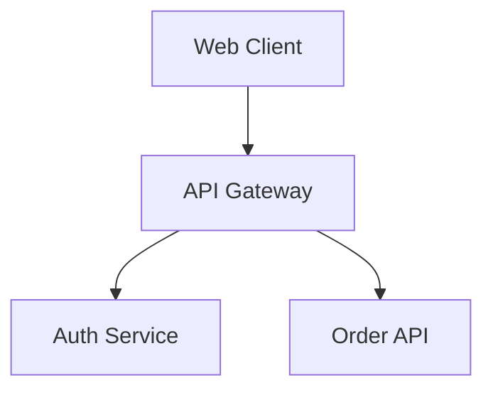

## Flowchart (ELK layout) (`flowchart-elk`)

- Stability: stable; export: **unsupported**; keywords: `flowchart-elk`
- Reason: mermaid@11.16.1 registers flowchart-elk but does not bundle the ELK layout loader (@mermaid-js/layout-elk).

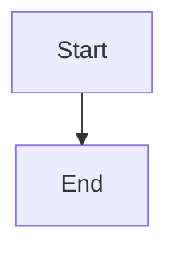

## Sequence diagram (`sequence`)

- Stability: stable; export: **supported**; keywords: `sequenceDiagram`

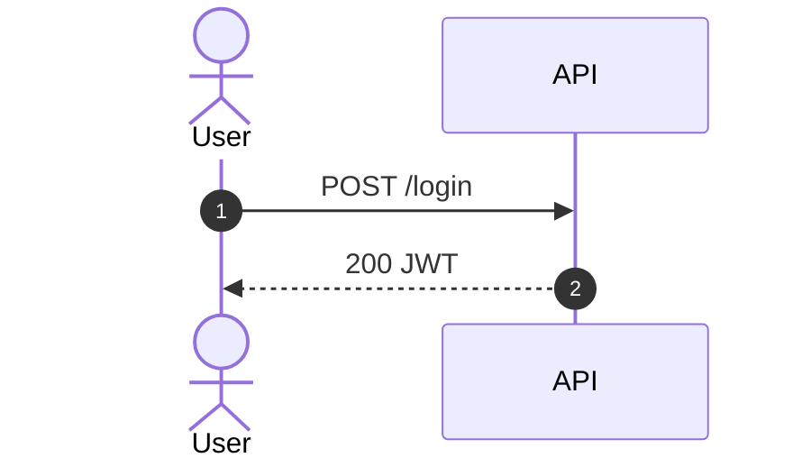

## Class diagram (`classDiagram`)

- Stability: stable; export: **supported**; keywords: `classDiagram`, `classDiagram-v2`

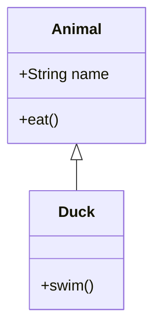

## State diagram (`stateDiagram`)

- Stability: stable; export: **supported**; keywords: `stateDiagram`, `stateDiagram-v2`

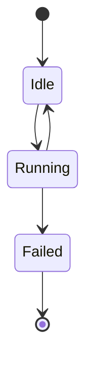

## Entity relationship (`er`)

- Stability: stable; export: **supported**; keywords: `erDiagram`

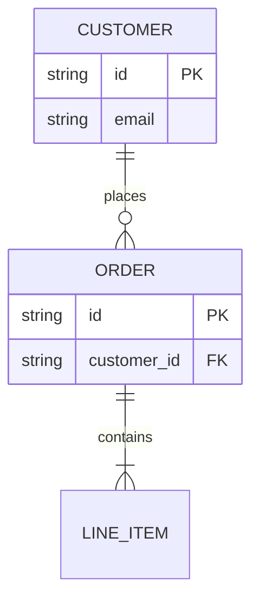

## Gantt chart (`gantt`)

- Stability: stable; export: **supported**; keywords: `gantt`

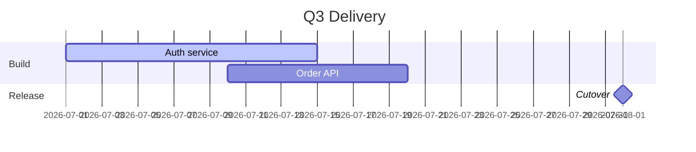

## Git graph (`gitGraph`)

- Stability: stable; export: **supported**; keywords: `gitGraph`

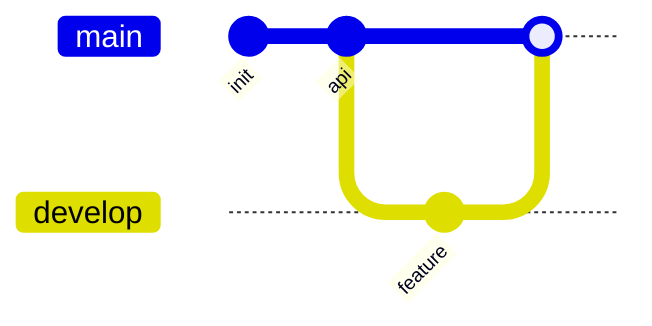

## Pie chart (`pie`)

- Stability: stable; export: **supported**; keywords: `pie`

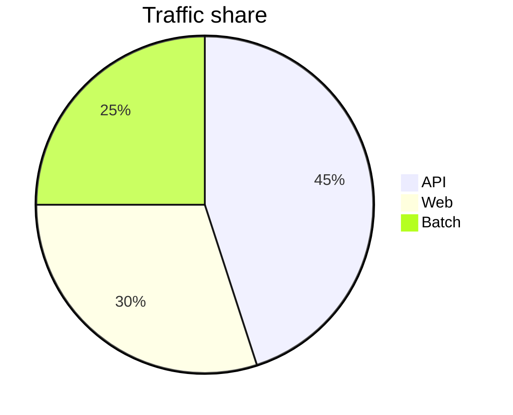

## Quadrant chart (`quadrantChart`)

- Stability: stable; export: **supported**; keywords: `quadrantChart`

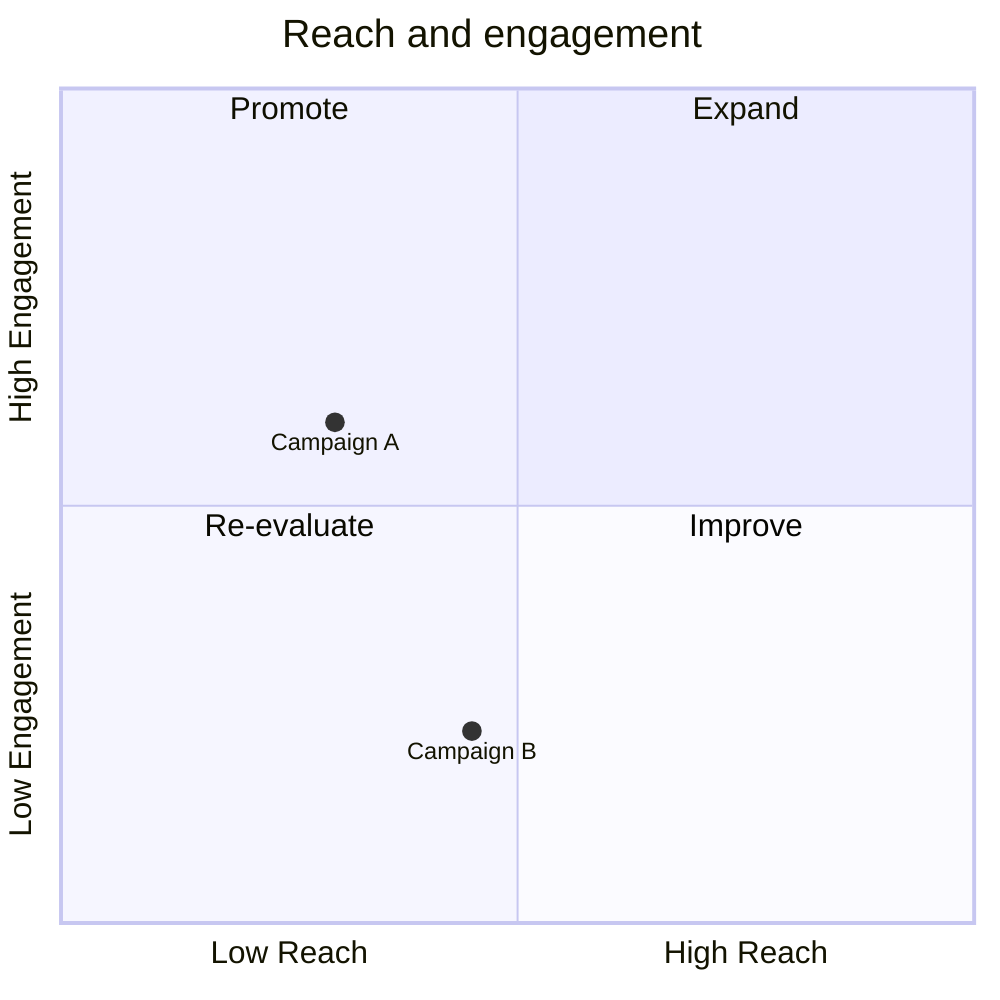

## Requirement diagram (`requirement`)

- Stability: stable; export: **supported**; keywords: `requirementDiagram`, `requirement`

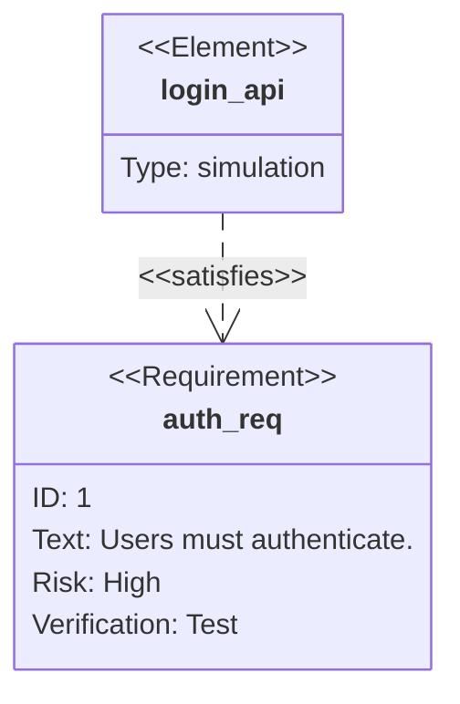

## C4 architecture (`c4`)

- Stability: stable; export: **supported**; keywords: `C4Context`, `C4Container`, `C4Component`, `C4Dynamic`, `C4Deployment`

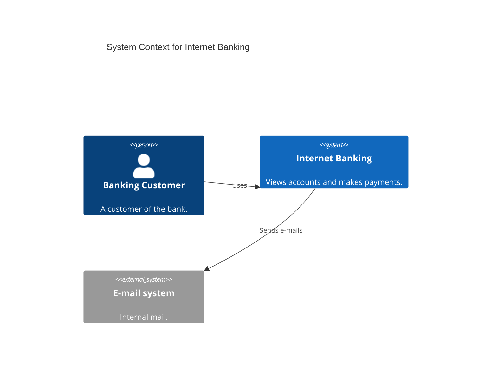

## Mindmap (`mindmap`)

- Stability: stable; export: **supported**; keywords: `mindmap`

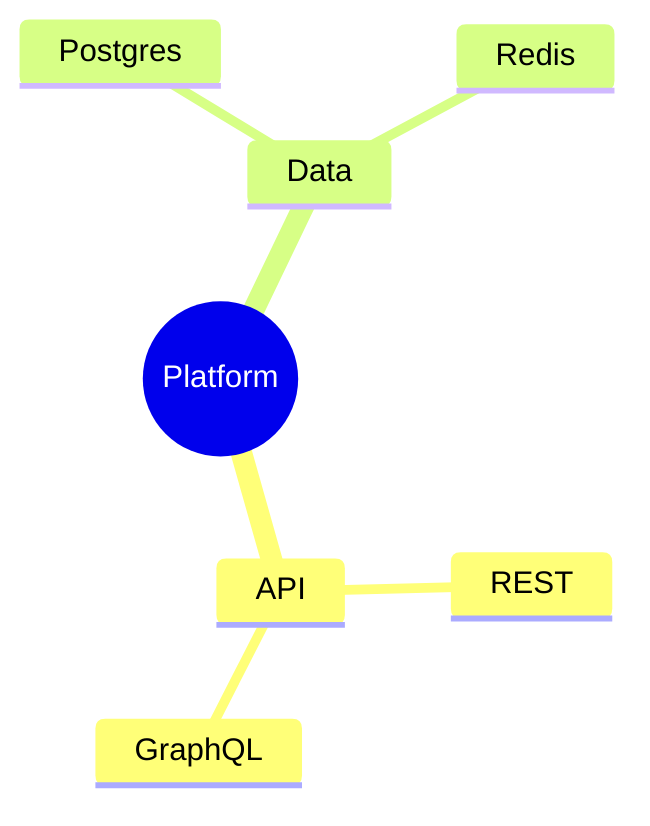

## User journey (`journey`)

- Stability: stable; export: **supported**; keywords: `journey`

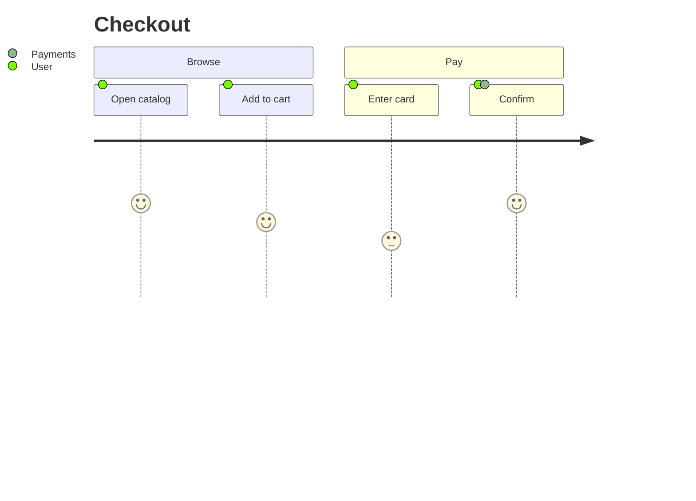

## Timeline (`timeline`)

- Stability: stable; export: **supported**; keywords: `timeline`

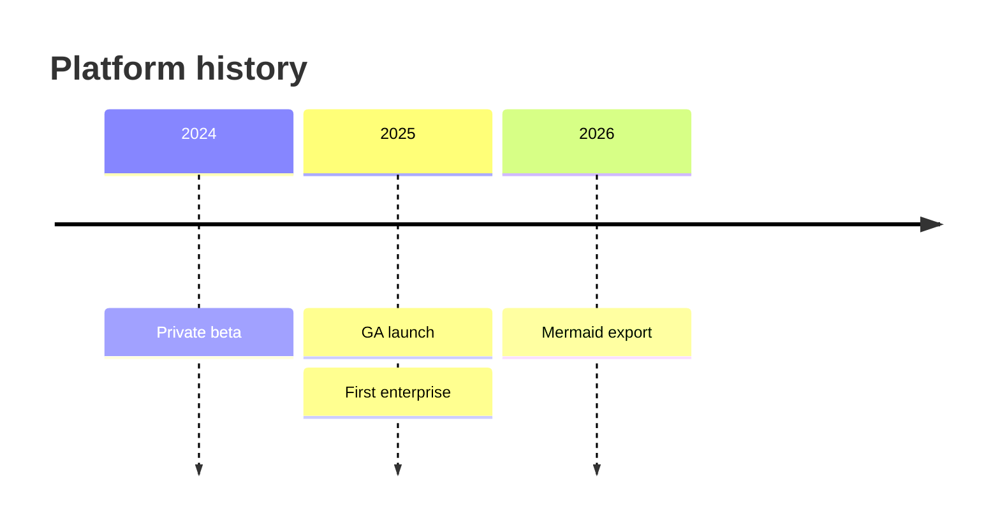

## Kanban (`kanban`)

- Stability: stable; export: **supported**; keywords: `kanban`

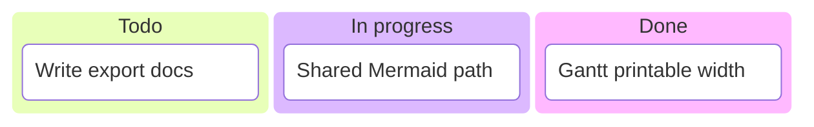

## Sankey (`sankey`)

- Stability: stable; export: **supported**; keywords: `sankey`, `sankey-beta`

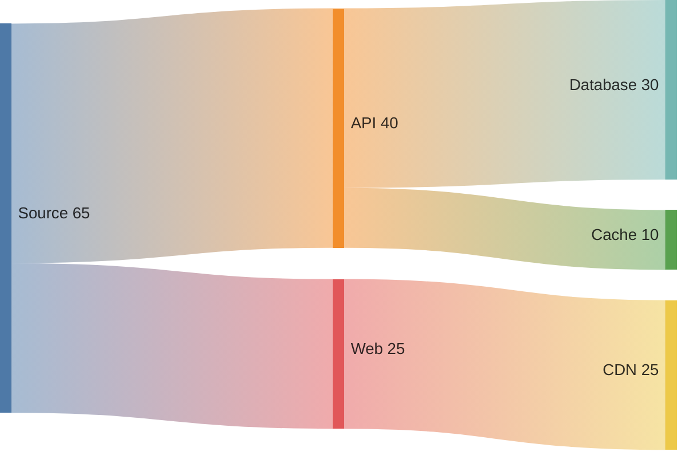

## Packet diagram (`packet`)

- Stability: stable; export: **supported**; keywords: `packet`, `packet-beta`

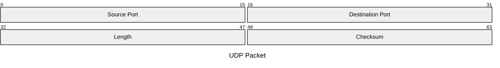

## XY chart (`xychart`)

- Stability: experimental; export: **supported**; keywords: `xychart`, `xychart-beta`

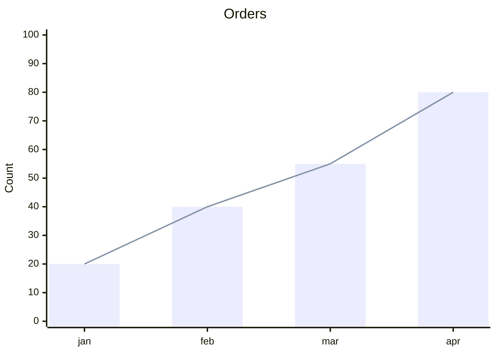

## Block diagram (`block`)

- Stability: stable; export: **supported**; keywords: `block`, `block-beta`

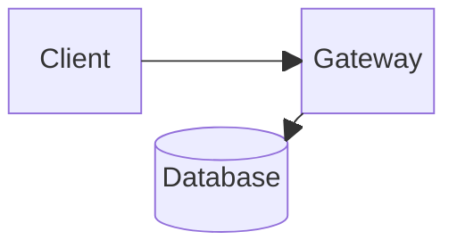

## Architecture diagram (`architecture`)

- Stability: experimental; export: **supported**; keywords: `architecture`, `architecture-beta`

```mermaid
architecture-beta
    group api(cloud)[API]
    service db(database)[Database] in api
    service server(server)[Server] in api
    db:L -- R:server
```

## Event modeling (`eventmodeling`)

- Stability: experimental; export: **supported**; keywords: `eventmodeling`

```mermaid
eventmodeling

tf 01 ui CartUI
tf 02 cmd AddItem
tf 03 evt ItemAdded
```

## Ishikawa (fishbone) (`ishikawa`)

- Stability: experimental; export: **supported**; keywords: `ishikawa`, `ishikawa-beta`

```mermaid
ishikawa-beta
    Export timeout
    Diagram
        Collapsed viewBox
        Missing useWidth
    Runtime
        10s raster cap
    Content
        Very wide gantt
```

## Treemap (`treemap`)

- Stability: experimental; export: **supported**; keywords: `treemap`, `treemap-beta`

```mermaid
treemap-beta
"Platform"
    "API": 40
    "Web": 25
    "Batch": 15
    "Other": 20
```

## Info (`info`)

- Stability: stable; export: **supported**; keywords: `info`

```mermaid
info
```

## Swimlanes (`swimlane`)

- Stability: experimental; export: **supported**; keywords: `swimlane-beta`

```mermaid
swimlane-beta LR
  subgraph Customer
    Browse[Browse catalogue]
    Pay[Pay]
  end
  subgraph Warehouse
    Pick[Pick items]
    Ship[Ship order]
  end
  Browse --> Pay --> Pick --> Ship
```

## Radar chart (`radar`)

- Stability: experimental; export: **supported**; keywords: `radar-beta`

```mermaid
radar-beta
  title Skills
  axis docs["Docs"], tests["Tests"], ux["UX"], perf["Perf"]
  curve a["Current"]{4, 3, 2, 4}
  curve b["Target"]{5, 4, 4, 4}
  max 5
```

## Tree view (`treeView`)

- Stability: experimental; export: **supported**; keywords: `treeView-beta`

```mermaid
treeView-beta
    src/
        mermaidConfig.ts
        mermaidCatalog.ts
    tests/
        mermaidAllDiagrams.test.ts
```

## Venn diagram (`venn`)

- Stability: experimental; export: **supported**; keywords: `venn-beta`

```mermaid
venn-beta
set A ["Backend"]
set B ["Frontend"]
union A,B ["Full-stack"]
```

## Wardley map (`wardley`)

- Stability: experimental; export: **supported**; keywords: `wardley-beta`

```mermaid
wardley-beta
title Tea Shop
anchor Business [0.95, 0.63]
component Cup of Tea [0.79, 0.61]
component Tea [0.63, 0.81]
component Hot Water [0.52, 0.80]
component Kettle [0.43, 0.35]
component Power [0.10, 0.70]
Business -> Cup of Tea
Cup of Tea -> Tea
Cup of Tea -> Hot Water
Hot Water -> Kettle
Kettle -> Power
```

## Cynefin framework (`cynefin`)

- Stability: experimental; export: **supported**; keywords: `cynefin-beta`

```mermaid
cynefin-beta
title Delivery decisions
complex
"Unknown failure mode"
complicated
"Needs specialist review"
clear
"Run the runbook"
chaotic
"Incident in progress"
confusion
"Not yet classified"
```

## Railroad (IR) (`railroad`)

- Stability: experimental; export: **supported**; keywords: `railroad-beta`

```mermaid
railroad-beta
title Digit
digit = choice(terminal("0"), terminal("1"), terminal("2")) ;
```

## Railroad (EBNF) (`railroadEbnf`)

- Stability: experimental; export: **supported**; keywords: `railroad-ebnf-beta`

```mermaid
railroad-ebnf-beta
title "Digit Definition"
digit = "0" | "1" | "2" | "3" | "4" | "5" | "6" | "7" | "8" | "9" ;
```

## Railroad (ABNF) (`railroadAbnf`)

- Stability: experimental; export: **supported**; keywords: `railroad-abnf-beta`

```mermaid
railroad-abnf-beta
title "Digit"
digit = "0" / "1" / "2" ;
```

## Railroad (PEG) (`railroadPeg`)

- Stability: experimental; export: **supported**; keywords: `railroad-peg-beta`

```mermaid
railroad-peg-beta
title "Digit"
Digit <- "0" / "1" / "2" ;
```
