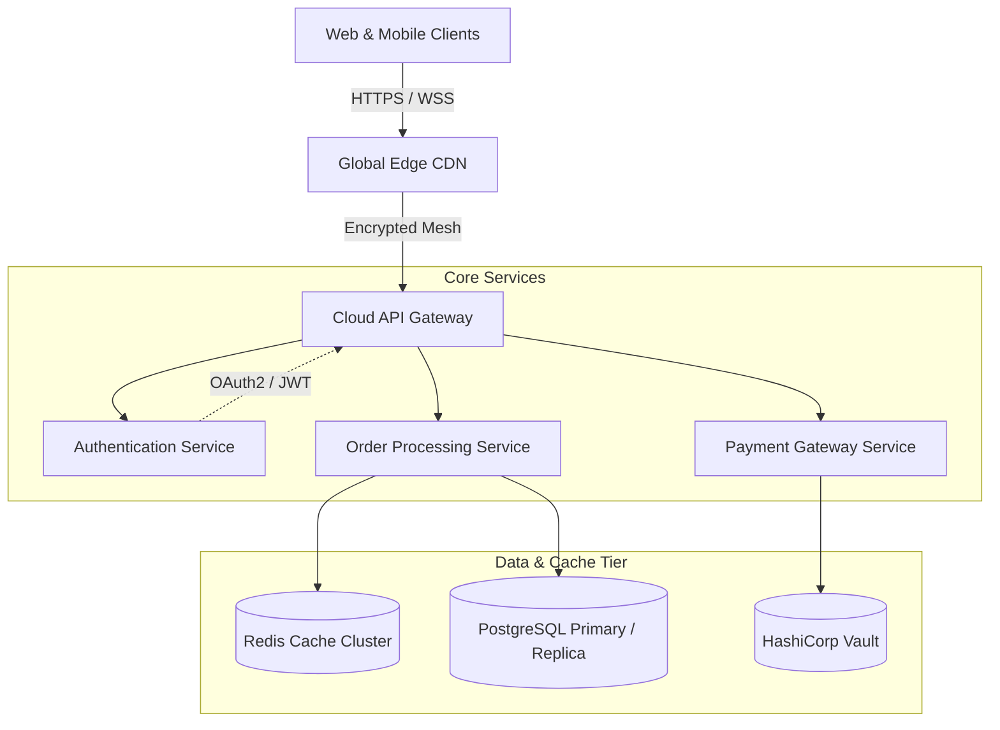
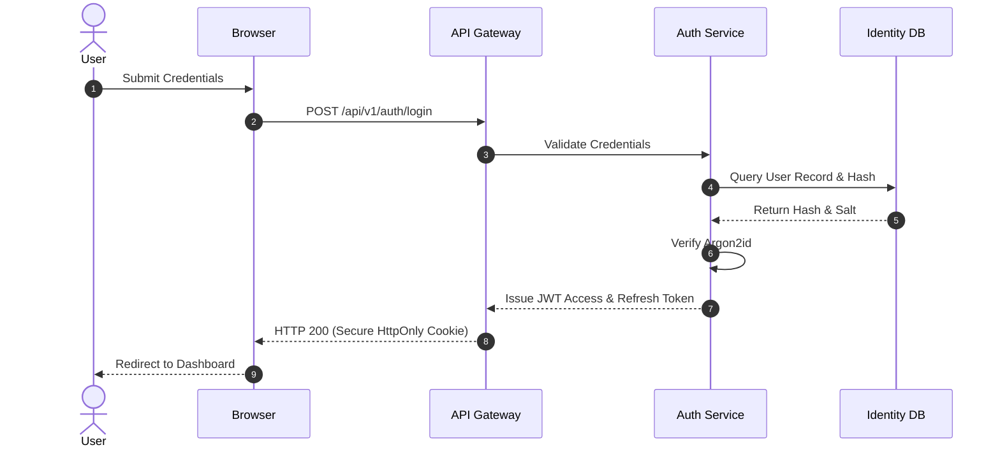
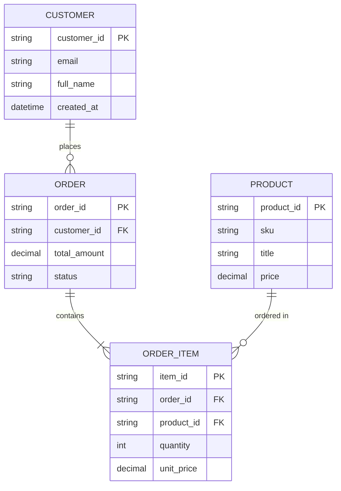

# Distributed Microservices Architecture & Math Specification

This document demonstrates the full rendering capabilities of the **Markdown to PDF (with Mermaid & Math)** extension.

---

## 1. System Topology (Flowchart)

Below is the microservices routing topology:



---

## 2. Authentication Flow (Sequence Diagram)



---

## 3. Mathematical Foundations (KaTeX LaTeX)

### 3.1 Normal Distribution Probability Density Function
The standard Gaussian probability density function is represented as:

$$f(x \mid \mu, \sigma^2) = \frac{1}{\sqrt{2\pi\sigma^2}} \exp\left( -\frac{(x - \mu)^2}{2\sigma^2} \right)$$

### 3.2 Euler's Identity & Energy Formulation
Inline equations work seamlessly: Euler's identity is defined as $e^{i\pi} + 1 = 0$, and relativistic energy is given by $E^2 = (mc^2)^2 + (pc)^2$.

### 3.3 Fourier Transform Definition
$$\hat{f}(\xi) = \int_{-\infty}^{\infty} f(x) e^{-2\pi i x \xi} \, dx$$

---

## 4. Entity Relationship Model



---

## 5. Performance Metrics & SLA Benchmarks

| Service | p50 Latency (ms) | p95 Latency (ms) | p99 Latency (ms) | Target Availability |
| :--- | :---: | :---: | :---: | :---: |
| **API Gateway** | 1.2 | 3.5 | 6.8 | 99.99% |
| **Auth Service** | 4.8 | 12.0 | 25.4 | 99.95% |
| **Order Service** | 8.5 | 18.2 | 38.0 | 99.99% |
| **Payment Service**| 45.0 | 95.0 | 180.0 | 99.999% |

> **Note on Reliability:** All critical path queries utilize connection pooling with circuit breakers configured to trip at $5\%$ consecutive failure rate.

```typescript
// Sample Circuit Breaker Definition
export class CircuitBreaker {
  private failureCount = 0;
  private state: 'CLOSED' | 'OPEN' | 'HALF_OPEN' = 'CLOSED';

  constructor(private readonly threshold: number = 5) {}

  async execute<T>(fn: () => Promise<T>): Promise<T> {
    if (this.state === 'OPEN') {
      throw new Error('Circuit breaker is OPEN. Fast failing.');
    }
    try {
      const result = await fn();
      this.failureCount = 0;
      return result;
    } catch (err) {
      if (++this.failureCount >= this.threshold) {
        this.state = 'OPEN';
      }
      throw err;
    }
  }
}
```
